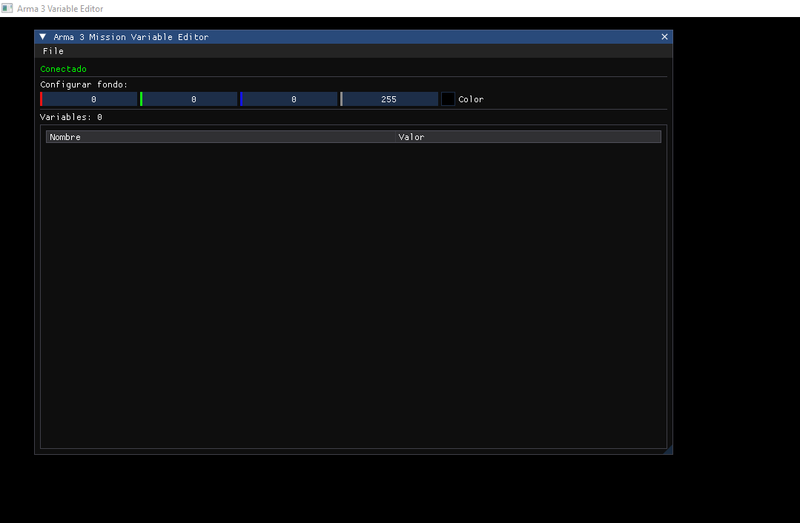

# Arma 3 External Variable Viewer

# Español / Spanish
Esta es una herramienta de análisis de memoria diseñada específicamente para el desarrollo y depuración de misiones en Arma 3. Esta aplicación externa proporciona visualización de variables del espacio de nombres de misión mediante una interfaz estilo overlay construida con ImGui.

## Características Principales
- **Lectura Externa de Memoria**: Utiliza ReadProcessMemory para acceder de forma segura a la memoria del proceso de Arma 3 sin inyección

- **Escáner de Variables**: Escanea y muestra automáticamente todas las variables de misión del missionNamespace de Arma 3

- **Actualizaciones en Tiempo Real**: Monitoriza continuamente los valores de las variables durante la partida

- **Arquitectura Preparada para DMA**: Diseñada con compatibilidad para Acceso Directo a Memoria

- **UI Personalizable**: Colores ajustables y transparencia de ventana para visibilidad óptima

## Detalles Técnicos
- **Acceso a Memoria**: Lectura externa basada en RPM para máxima estabilidad y compatibilidad

- **Tipos de Variables**: Actualmente soporta variables float con arquitectura extensible para tipos adicionales

- **Rendimiento**: Renderizado ligero con DirectX 11 y algoritmos eficientes de escaneo de memoria

## Configuración y Uso
    1. Ejecuta Arma 3 e inicia una misión

    2. Inicia la aplicación

    3. Si no se conecta automáticamente, haz clic en "Conectar al Juego"

    4. Usa "Escanear Variables" (Ctrl+E) para cargar las variables en la lista

    5. Usa "Limpiar Lista" (Ctrl+L) para vaciar la lista de variables

# English
This is a memory analysis tool specifically designed for mission development and debugging in Arma 3. This external application provides visualization of mission namespace variables through an overlay-style interface built with ImGui.

## Key Features
- **External Memory Reading**: Uses ReadProcessMemory to safely access Arma 3's process memory without injection

- **Variable Scanner**: Automatically scans and displays all mission variables from Arma 3's missionNamespace

- **Real-time Updates**: Continuously monitors variable values during gameplay

- **DMA-Ready Architecture**: Designed with compatibility for Direct Memory Access

- **Customizable UI**: Adjustable colors and window transparency for optimal visibility

## Technical Details
- **Memory Access**: External RPM-based reading for maximum stability and compatibility

- **Variable Types**: Currently supports float variables with extensible architecture for additional types

- **Performance**: Lightweight DirectX 11 rendering with efficient memory scanning algorithms

## Setup and Usage
    1. Launch Arma 3 and start a mission

    2. Start the application

    3. If it doesn't connect automatically, click "Connect to Game"

    4. Use "Scan Variables" (Ctrl+E) to load variables into the list

    5. Use "Clear List" (Ctrl+L) to empty the variable list

## Screenshots

